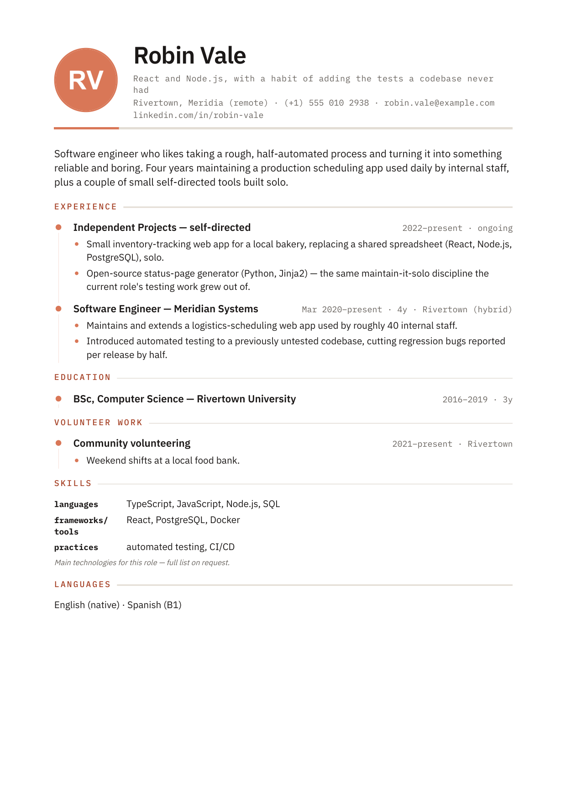

# JobHuntKit

A small, opinionated toolkit that turns one master CV and a per-posting selection file into a
validated, one-page, tailored PDF — markdown in, PDF out, no hand-copying, no drift between
applications.



*(Robin Vale and Orbital Dynamics are fictional — the image above is `demo.sh`'s output.)*

## Why

Hand-tailoring a CV per application means re-typing the same wording over and over, and it's
easy for one application to quietly lose an entry the others have. This toolkit inverts that:
you write your full background **once**, as a set of tagged blocks (a "master"), and a small
generator assembles each application's CV by selecting from it. A structural spine — entries
that must appear on every CV, in a fixed order — is enforced by a validator, not by memory.

It is deliberately opinionated: **one page, a locked spine, generated output you never
hand-edit.** If that's not the shape of CV you want, this probably isn't the tool for you — but
if it is, it removes an entire category of copy-paste mistakes.

## 60-second demo

```bash
git clone https://github.com/MikeC42001/JobHuntKit && cd JobHuntKit
bash demo.sh
```

That's it — no `pip install`, no config. It builds and renders a fictional CV for a fictional
persona ("Robin Vale," applying to a fictional company) using nothing but `python3`, `node`, and
whichever Chrome/Edge/Chromium/Brave you already have installed. Requirements: Python 3.8+, a
recent Node.js, and one Chromium-family browser. Windows users: run it from Git Bash.

## How it works

```
master/master_cv_minimal.md   (everything you could say, tagged with @id blocks)
templates/minimal-full.md     (which slots exist, in what order, which are locked)
applications/offer-pages/<Company>/application.md
                               (the pitch for this one posting — tagline, About me,
                                which projects, what to omit and why)
        │
        ▼   engine/build_cv.py
applications/offer-pages/<Company>/cv-minimal.md
        │
        ▼   engine/render_cv_minimal.sh
applications/offer-pages/<Company>/generate-pdfs/cv-minimal.pdf
```

`application.md` is the only file you hand-edit per application. `cv-minimal.md` and the PDF
are generated — edit `application.md` and re-run instead of touching them, or the next build
silently overwrites your change.

There's a second, simpler path for the **full CV** — the long-form document you keep current and
hand people, as opposed to the one-page, per-posting `cv-minimal.pdf` above. No build step, no
template: `render_cv.sh` and `render_cv_photo.sh` render *any* CV markdown, comments and all,
including a master file pointed at directly:

```
master/master_cv_minimal.md   (or any hand-written CV markdown — no @id scheme required)
        │
        ▼   engine/render_cv.sh          (single-column, ATS-safe, no photo)
        ▼   engine/render_cv_photo.sh    (two-column, circular photo)
master/generate-pdfs/cv.pdf
master/generate-pdfs/cv-photo.pdf
```

In one line: **`cv-minimal.pdf` is what you send; the full CV is what you have.** Both renderers
strip `<!-- ... -->` comments themselves (so a master's `<!-- @id -->` markers never reach the
PDF) and honor a `<!-- render:stop -->` tag for anything that shouldn't render at all, like a
master's "Notes for tailoring" section — see `docs/SPEC.md`'s "id-agnostic rendering" section for
the full contract. There's no validator on this path; `check_cv.py` runs only where `@id`s exist.

## Quickstart with your own data

```bash
python scripts/init_workspace.py    # scaffolds config.json, master/, profile/, applications/
```

Fill in `config.json`, `profile/background.md`, and `master/master_cv_minimal.md`, decide your
locked spine, then build/validate/render/verify the same way `demo.sh` does. Full walkthrough,
in order: **[docs/GETTING-STARTED.md](docs/GETTING-STARTED.md)**.

`--root` can point anywhere, including outside this checkout entirely — your own private repo,
for instance — so the engine never needs to touch your data directly:

```bash
python3 scripts/init_workspace.py --root ~/my-cv-data
python3 engine/build_cv.py --root ~/my-cv-data --all
```

Format contract (`@id` marker rules, `{{...}}` placeholder grammar, the locked-vs-optional spine
concept): [docs/SPEC.md](docs/SPEC.md). Every `config.json` key: [docs/CONFIG.md](docs/CONFIG.md).
Running the whole pipeline by hand, no agent involved: [docs/NO-AI.md](docs/NO-AI.md).

## Scripts

| Script | Does |
|---|---|
| `scripts/init_workspace.py` | Scaffolds a fresh data root from `templates/` — config.json, master/, profile/, applications/ |
| `engine/scan_applications.py` | Classifies every company as NEW/CURRENT/STALE/SENT/DECLINED, independently for the CV and the cover letter |
| `engine/extract_posting.py` | Turns a saved job-posting page (or `.txt`/pasted text) into a skimmable dump, via the pluggable `engine/extractors/` registry — see `docs/EXTRACTORS.md` |
| `engine/build_cv.py` | Assembles `cv-minimal.md` from the master + template + `application.md` |
| `engine/check_cv.py` | Validates the locked spine landed correctly (`structure`, the default) and reports what's present/omitted/silently-missing per application (`--coverage`) |
| `engine/verify_cvs.py` | Confirms a rendered PDF is exactly one page (or whatever `limits.max_pages` says) |
| `engine/render_cv_minimal.sh` | Renders `cv-minimal.md` to a one-column PDF with a circular photo |
| `engine/render_cv.sh` | Renders any CV markdown (built, a master, or hand-written) to a single-column, ATS-safe PDF — no build step required |
| `engine/render_cv_photo.sh` | Same, but two-column with a circular photo — the full-CV companion to `render_cv_minimal.sh`'s photo styles |
| `engine/render_letter.sh` | Renders `cover_letter.md` to a clean, prose-only PDF |
| `engine/md_to_email_txt.py` | Flattens a hand-wrapped cover letter into paste-ready plain email text |
| `engine/collect_cvs.py` | Stages rendered CVs into `produced/to_send/` for review |
| `engine/collect_letters.py` | Same, for one cover letter at a time — no bulk mode, by design |
| `engine/lib.sh` | Shared cross-platform browser discovery, sourced by the renderers |

## Status

Working: build, validate (structure + coverage), render, verify, and now onboarding — blank
starter templates, `scripts/init_workspace.py`, the published format contract
(`docs/SPEC.md`/`docs/CONFIG.md`/`docs/GETTING-STARTED.md`/`docs/NO-AI.md`), and portable agent
instructions (`agents/CONTEXT.md` + `agents/cv-setup.md`, wired up as a Claude Code skill/command
and a Cursor rule) — all cross-platform. `check_cv.py`'s locked spine, education requirements,
and verbatim-line checks are entirely `config.json`-driven; a fresh root with nothing configured
prints a clear "not configured" message rather than a false "all OK". A leak gate
(`scripts/audit_public.py`) and a manifest-bounded sync mechanism (`engine.manifest` +
`scripts/sync.sh`) are also in — `bash scripts/install_hooks.sh` wires the same check into a
pre-commit hook. Now also in: the full loop — `scan_applications.py` (what needs attention),
`extract_posting.py` + a pluggable `engine/extractors/` registry (`linkedin`, `plaintext`,
`generic` today; `docs/EXTRACTORS.md` is the how-to for adding one), `collect_cvs.py`/
`collect_letters.py` (staging finished PDFs for review), cover letters (`render_letter.sh`,
`md_to_email_txt.py`), and `agents/cv-tailor.md` wiring all of it into one agent-driven pass. A
pytest suite covers the golden build, the structure/coverage checkers, the leak gate, the
scaffolding script, the scan/collect/extractor logic, and the email flattener (see Running tests
below), and CI (`.github/workflows/ci.yml`) runs it on every push — lint, the pytest suite on
ubuntu/macos/windows, and a render-matrix job proving `demo.sh` actually works end-to-end on
ubuntu and macOS, not just the Windows machine it was built on. Now also in: the full-CV pipeline
— `render_cv.sh`/`render_cv_photo.sh`, id-agnostic renderers that clean their own input (comment
stripping, a `<!-- render:stop -->` tag), so a master file renders directly with no build step.
`verify_cvs.py --max-pages` lets a multi-page artifact be checked (or the gate disabled entirely)
without touching the global one-page default. Not yet built: extractors for Greenhouse/Lever/
Workday/Indeed (filed as `good first issue`s), a generated ChatGPT-paste variant of the agent
instructions, a dedicated `master_cv.md`/`templates/full.md` pair with its own `build_cv.py`
pipeline (today the full-CV renderers work directly off `master_cv_minimal.md`), and a roomier
spine-only template. Tracked as milestones in this repo's issues.

## Running tests

```bash
pip install -r requirements-dev.txt
python3 -m pytest tests/
```

Pure-Python, no browser or Node.js needed — covers `build_cv.py` (golden-file diff against
`examples/demo/expected/`), `check_cv.py` (broken-spine fixtures, coverage math), and
`audit_public.py`/`sync.sh` (leak-gate fixtures, plus an end-to-end check that a root's private
content never enters `sync.sh push`'s scanned or copied file list).

## Config

Everything person-specific lives in `config.json` (JSON, not YAML — no extra dependency to
parse it). Copy `config.example.json` to get started — it lists every key with its default.
At minimum you'll want `person.name`, `person.file_prefix`, and optionally `render.default_photo`.

## Requirements

- Python 3.8+ (stdlib only — no `pip install` for the engine itself)
- Node.js (the renderer installs its one dependency, `marked`, on first run)
- A Chromium-family browser — Chrome, Edge, Chromium, or Brave. Auto-detected; override with
  `BROWSER_BIN=/path/to/browser` or `render.browser_bin` in `config.json`.

## Privacy

The engine (`engine/`) never contains personal data — everything you write lives in a data
root that's resolved at runtime (`--root`, `$JOBHUNTKIT_ROOT`, or this checkout by default).
Nothing in this repo's history, other than the fictional demo persona, is real.

## Contributing

See [CONTRIBUTING.md](CONTRIBUTING.md) — the short version: never commit real CV data, run
`bash scripts/install_hooks.sh` once per clone, and `python -m pytest tests/` +
`ruff check engine scripts tests` before a PR.

## License

MIT — see `LICENSE`. Bundled fonts (IBM Plex) are SIL OFL 1.1; see `NOTICE`.
